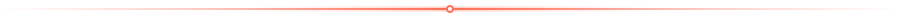

<div align="center">

  <!-- Header Banner -->
  

  <br/><br/>

  <!-- Quick Social Badges -->
  <a href="https://thevinuvinan.com" target="_blank">
    
  </a>
  <a href="https://www.linkedin.com/in/thevinu/" target="_blank">
    
  </a>
  <a href="https://www.behance.net/thevinug" target="_blank">
    
  </a>
  <a href="https://drive.google.com/file/d/1sR-lIPvh8HXGrOti4mlEYPbFJ8HJ4g3z/view?usp=sharing" target="_blank">
    
  </a>
  <a href="https://github.com/ThevinuGunawardena">
    
  </a>

</div>

<br/>



## 🌟 About Me

> *"Endlessly Creating from Within"*

I am **Thevinu Gunawardena**, a versatile **UI/UX Designer**, **Full-Stack Developer**, and **DevOps Enthusiast** based in Sri Lanka 🇱🇰. I bridge the intersection between clean, human-centered visual design and scalable, high-performance software engineering.

- 🎨 **UI/UX & Visual Design:** Crafting intuitive, pixel-perfect user journeys, interactive web prototypes, and engaging brand identities.
- 💻 **Full-Stack Development:** Architecting responsive, modern web and mobile applications using modern frameworks and robust backends.
- ⚙️ **DevOps & Cloud:** Automating CI/CD pipelines, containerizing applications with Docker, and orchestrating reliable deployments.
- 🤝 **Proven Track Record:** Collaborated with over **16+ commercial brands, startups, and institutions** across health, fashion, hospitality, and tech sectors.

---

## 🚀 Featured Projects

Here are some of the flagship projects I've built and designed:

<table>
  <tr>
    <td width="50%" valign="top">
      <h3 align="center">📱 UniSync</h3>
      <p align="center"><b>Campus Sync Web & Mobile Platform</b></p>
      <p>The ultimate campus hub connecting students and lecturers with real-time academic updates, scheduling, and tools right at their fingertips.</p>
      <p>
        <a href="https://unisync.thevinuvinan.com" target="_blank">
          
        </a>
      </p>
      <p><code>React</code> • <code>Node.js</code> • <code>Mobile</code> • <code>UI/UX</code> • <code>Realtime</code></p>
    </td>
    <td width="50%" valign="top">
      <h3 align="center">🛍️ KDU Armcut & Merch</h3>
      <p align="center"><b>E-Commerce & Merchandise Platform</b></p>
      <p>A responsive, high-converting digital storefront designed to showcase university merchandise with seamless navigation and optimized loading performance.</p>
      <p>
        <a href="https://kdumerch.thevinuvinan.com" target="_blank">
          
        </a>
      </p>
      <p><code>Web Design</code> • <code>E-Commerce</code> • <code>Responsive UI</code> • <code>Performance</code></p>
    </td>
  </tr>
  <tr>
    <td width="50%" valign="top">
      <h3 align="center">🏢 NDS Investments</h3>
      <p align="center"><b>Corporate Financial & Investment Portal</b></p>
      <p>An informative corporate web portal engineered for NDS Investments (Pvt) Ltd, emphasizing institutional trust, brand sophistication, and modern typography.</p>
      <p>
        <a href="https://ndsinvestments.com/" target="_blank">
          
        </a>
      </p>
      <p><code>Corporate Web</code> • <code>Branding</code> • <code>SEO</code> • <code>Full-Stack</code></p>
    </td>
    <td width="50%" valign="top">
      <h3 align="center">🎨 Creative Design Showcase</h3>
      <p align="center"><b>Merchandise, Brand Identity & UI Kits</b></p>
      <p>A curated portfolio of brand identity systems, product apparel mockups, 3D modeling, and marketing collateral produced for multiple international and domestic clients.</p>
      <p>
        <a href="https://www.behance.net/thevinug" target="_blank">
          
        </a>
      </p>
      <p><code>Figma</code> • <code>Adobe XD</code> • <code>Photoshop</code> • <code>Illustrator</code> • <code>3D</code></p>
    </td>
  </tr>
</table>

---

## 🛠️ Tech Stack & Tooling

<div align="center">

### 🎨 UI/UX & Creative Design
<p>
  
  
  
  
  
</p>

### 💻 Frontend Development
<p>
  
  
  
  
  
  
  
</p>

### ⚙️ Backend, Mobile & DevOps
<p>
  
  
  
  
  
  
  
  
  
</p>

</div>

---

## 🤝 Trusted by Brands & Collaborators

I've had the honor and privilege of collaborating with distinguished organizations and brands:

```text
✦ Hello Doctor  ✦ Rekha Jewelers  ✦ Omega Regenciese  ✦ AVID Academy
✦ Choice Natural ✦ Choice International ✦ Light Of Love ✦ Muve
✦ AccSense      ✦ M&M / WEC       ✦ Maxmark           ✦ Glovwera
✦ Events For You ✦ Suvinro         ✦ ASW / Mc Lion     ✦ PSK / Vibes Events
```

---

## 📊 GitHub Analytics

<div align="center">
  <table border="0">
    <tr>
      <td align="center" valign="middle">
        <a href="https://github.com/ThevinuGunawardena">
          
        </a>
      </td>
      <td align="center" valign="middle">
        <a href="https://github.com/ThevinuGunawardena">
          
        </a>
      </td>
    </tr>
    <tr>
      <td colspan="2" align="center">
        <a href="https://github.com/ThevinuGunawardena">
          
        </a>
      </td>
    </tr>
  </table>
</div>

<br/>


## 📬 Let's Connect & Collaborate!

I am always open to discussing new projects, creative concepts, full-stack architectures, or collaborative opportunities:

<div align="center">
  <br/>
  <a href="https://thevinuvinan.com" target="_blank">
    
  </a>
  &nbsp;
  <a href="https://www.linkedin.com/in/thevinu/" target="_blank">
    
  </a>
  &nbsp;
  <a href="https://www.behance.net/thevinug" target="_blank">
    
  </a>
  &nbsp;
  <a href="https://drive.google.com/file/d/1sR-lIPvh8HXGrOti4mlEYPbFJ8HJ4g3z/view?usp=sharing" target="_blank">
    
  </a>
  <br/><br/>
  <sub>Designed &amp; Crafted with passion by <b>Thevinu Gunawardena</b> &bull; &copy; 2026</sub>
</div>
